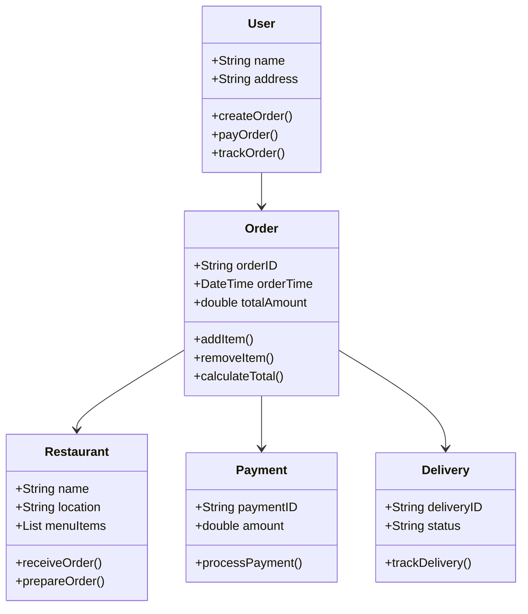
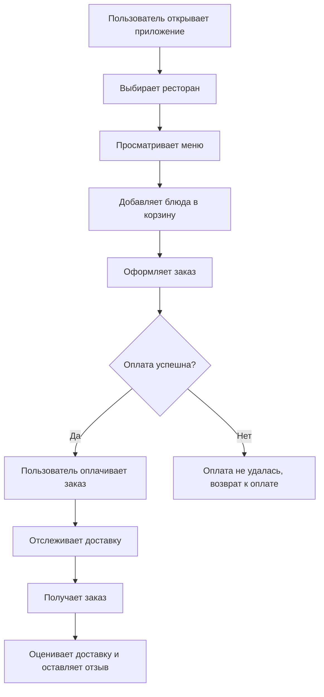
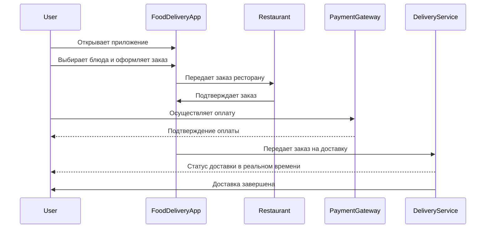

# is32kKhamatov
# FoodDeliveryApp

**FoodDeliveryApp** — это мобильное приложение для заказа еды из ресторанов с доставкой на дом. Оно позволяет пользователям выбирать блюда из различных заведений, оплачивать заказы через встроенные платежные системы и отслеживать статус доставки в реальном времени.

---

## Основные функции

1. **Выбор ресторанов**:
   - Возможность просматривать меню различных ресторанов и выбирать понравившиеся блюда.
   
2. **Оформление заказа**:
   - Выбор блюд и добавление их в корзину с последующим оформлением заказа.
   
3. **Оплата заказа**:
   - Встроенные способы оплаты, поддерживающие карты, электронные кошельки и оплату при доставке.

4. **Отслеживание доставки**:
   - Реальное время отслеживания статуса заказа, включая время приготовления и прибытие курьера.

5. **История заказов**:
   - Просмотр предыдущих заказов и возможность повторного оформления заказа.

6. **Оценка и отзывы**:
   - Оставление отзывов на блюда и оценка качества доставки.

---

## UML Диаграммы

### Диаграмма классов 

- User: пользователь, который создает заказы, оплачивает их и отслеживает доставку.
- Restaurant: ресторан, который получает и готовит заказы.
- Order: заказ, который содержит информацию о блюдах и общей сумме.
- Delivery: процесс доставки заказа и его отслеживание.
- Payment: обработка оплаты заказа.
### Диаграмма активности 

- Диаграмма активности описывает процесс оформления и отслеживания заказа от выбора ресторана до получения заказа и оставления отзыва.
### Диаграмма последовательности 

- Диаграмма последовательности описывает взаимодействие пользователя с приложением, рестораном, платёжной системой и службой доставки.
---

## Заключение
### Приложение FoodDeliveryApp создаёт удобный интерфейс для заказа еды из ресторанов, предлагая пользователям эффективный способ выбора блюд, оплаты и отслеживания доставки. С помощью этого приложения пользователи смогут получать свои любимые блюда быстро и с комфортом.

